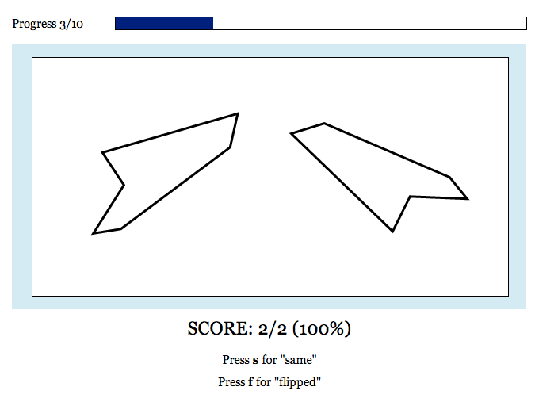

# Mental Rotation Experiment

Code to run the mental rotation experiment from Hamrick & Griffiths
(2014).

## Methods

This is a behavioral experiment based on classic mental rotation
studies (Shepard & Metzler, 1971; Cooper, 1975). For further details,
see Hamrick & Griffiths (2014).

### Stimuli

We randomly generated 20 shapes of five or six vertices. For each
shape, we computed 20 "same" and 20 "flipped" stimuli pairs, with 18
rotations (theta) spaced at 20 degree increments between 0 degrees and
360 degrees (with 0 degrees and 180 degrees repeated twice, in order
to gather an equal number of responses for each angle between 0
degrees and 180 degrees). "Same" pairs were created by rotating X_a by
theta; "flipped" pairs were first reflected X_a across the y-axis,
then rotated by theta.

We generated five additional shapes to be used in a practice block of
10 trials. Across these trials, there was one "flipped" and one "same"
repetition of each shape and each angle (60 degrees, 120 degrees,
180 degrees, 240 degrees, or 300 degrees) such that no shape was
presented at the same angle twice. We also generated a sixth shape to
include with the instructions.  This shape had both a "flipped" and
"same" version, each rotated to 320 degrees.

### Design

We recruited 247 participants on Amazon's Mechanical Turk using the
[psiTurk experiment framework](http://psiturk.org/). Each participant
was paid $1.00 for 15 minutes of work, consisting of one block of 10
practice trials followed by two blocks of 100 randomly ordered
experiment trials.

All participants saw the same 10 practice trials as described
above. There were 720 unique experimental stimuli (20 shapes x 18
angles x 2 reflections), though because stimuli with rotations of 0
degrees or 180 degrees were repeated twice, there were 800 total
experimental stimuli. These stimuli were split across eight conditions
in the following manner: first, stimuli were split into four blocks of
200 trials. Within each block, each shape was repeated ten times and
each rotation was repeated ten times (five "same", five "flipped"),
such that across all blocks, each stimulus appeared once. Each block
was then split in half, and participants completed two half-blocks.

### Procedure

Participants were given the following instructions while being shown
an example "same" pair and an example "flipped" pair: *"On each trial,
you will see two images. Sometimes, they show the **same**
object. Other times, the images show **flipped** objects. The task is
to determine whether the two images show the **same** object or
**flipped** objects."*

On each trial, participants were instructed to press the 'b' key to
begin and to focus on the fixation cross that appeared for 750ms
afterwards. The two images were then presented side-by-side, each at
300px x 300px, and participants could press 's' to indicate they
thought the images depicted the "same" object, or 'd' to indicate they
thought the images depicted "flipped" objects.  While there was no
limit on RT, we urged participants to answer as quickly as possible
while maintaining at least 85% accuracy in the experimental blocks.

## How to run the experiment

To run the experiment yourself, you will need to change several parts
of the code:

1. You will need to change references to the organization name in
   `templates/ad.html` and `templates/consent.html`.
2. You will need to change the logos for your organzation. Put them in
   `static/images/`, and then update the references in
   `templates/ad.html` and `templates/consent.html`.
3. Similarly, you should replace the favicon at `static/favicon.ico`
   with an image for your organization.
4. You will need to change the consent form in
   `templates/consent.html` to comply with your IRB protocol.
5. You will need to update the contact emails in
   `templates/consent.html` and `templates/error.html`.
